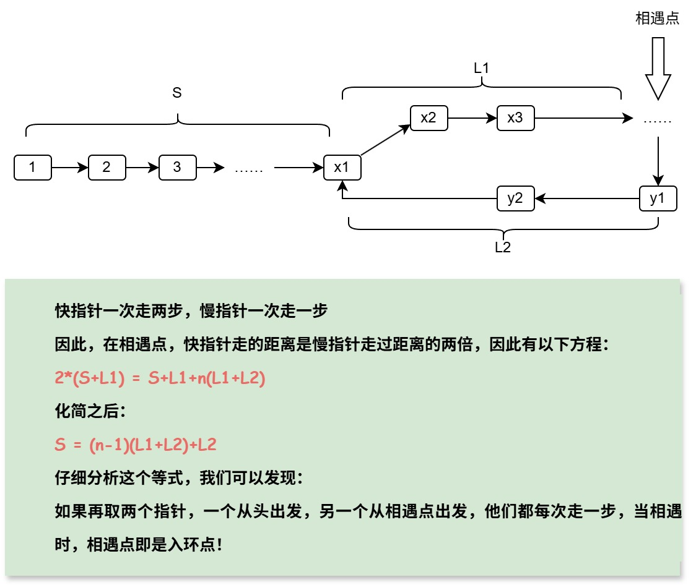

## **一、背景**

Floyd 循环检测算法（又称龟兔赛跑算法），由Robert W.Floyd于1967 年提出，用于检测链表中是否存在环，并找到环的起点。

## **二、算法设计**

### **2.1问题定义**

Floyd循环检测法要解决什么问题？

1. 判断一条链路中是否有环？
2. 如果有环，那么环的入口是哪里？

### **2.2算法思路**

如果一条链表存在环路，那么一快一慢两个指针一定会相遇，我们假设快指针一次走两步，慢指针一次走一步，最终相遇。那么，相遇时快指针走的距离是慢指针距离的两倍，这其中应该有一些数学关系可以推导，我们来看一下。



### **2.3算法设计**

要实现这个算法，需要分两步走：

1. 快慢指针检测环
2. 双指针确定“入环点”

#### **步骤一：检测环**

（1）初始化快慢指针

- 慢指针slow指向链表头结点
- 快指针fast指向链表头结点
  
（2）移动指针

- 慢指针每次移动1步，slow = slow.next
- 快指针每次移动2步，fast = fast.next.next
- 重复此过程直到：
  - 快指针=null，表示链表没有环路
  - 快指针=慢指针，表示链表有环路

#### **步骤二：寻找环的入口**

（1）重置指针

- 慢指针slow指向链表头结点
- 快指针在相遇点不变

（2）同步移动

- 慢指针每次移动1步，slow = slow.next
- 快指针每次移动1步，fast = fast.next
- 循环上面的步骤，直到快慢指针再次相遇，相遇点即为“入环点”，理由参考2.2中图示

## **三、代码实现（Java）**

### **3.1Java实现**

```Java
class ListNode {
    int val;
    ListNode next;
    ListNode(int x) {
        val = x;
        next = null;
    }
}
public class CycleDetection {

    /**
     * 检测链表是否有环并返回环的入口节点
     * @param head 链表头节点
     * @return 环的入口节点，如果无环返回null
     */
    public static ListNode detectCycle(ListNode head) {
        if (head == null || head.next == null) {
            return null;
        }
        
        ListNode slow = head;
        ListNode fast = head;
        
        // 第一阶段：检测是否有环
        while (fast != null && fast.next != null) {
            slow = slow.next;
            fast = fast.next.next;
            
            if (slow == fast) {
                // 有环，进入第二阶段：寻找环入口
                slow = head;
                while (slow != fast) {
                    slow = slow.next;
                    fast = fast.next;
                }
                return slow; // 环的入口节点
            }
        }
        
        return null; // 无环
    }
}

```
